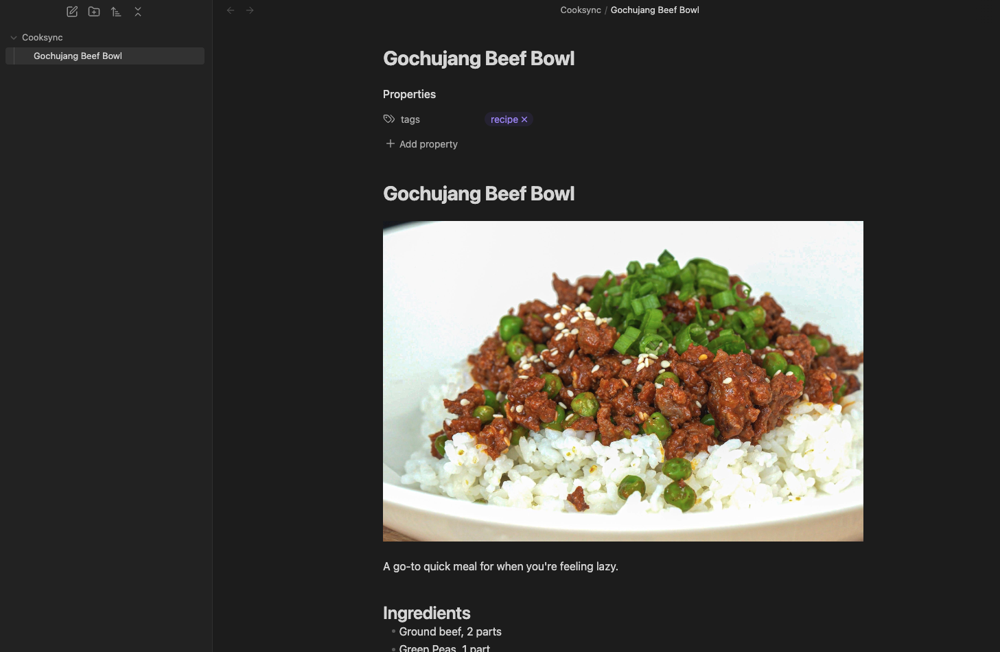

# Cooksync Official

This is the official Obsidian plugin for [Cooksync](https://cooksync.app), maintained by the Cooksync team. It enables automatic import of recipe data from your Cooksync account. Note that this plugin requires a [Cooksync](https://cooksync.app) account — a paid service that makes it easy to collect recipes from almost any recipe website.

## Features

-   Automatically sync your Cooksync recipes into Obsidian
-   Includes recipe data, source, and cover image
-   Option to automatically add tags to imported recipes

## Installation and Usage

1. Install the Cooksync plugin within Obsidian.
2. Enable the plugin.
3. Go to the plugin settings and connect your Cooksync account.
4. Customize the export settings, if desired.
5. Initiate the first sync.
6. Choose whether to keep auto-sync enabled or manually run the "Cooksync Sync" command to import recipes.

## Support

-   Check our [Documentation](https://cooksync.app/docs).
-   For additional assistance, please email us at info@cooksync.app.
